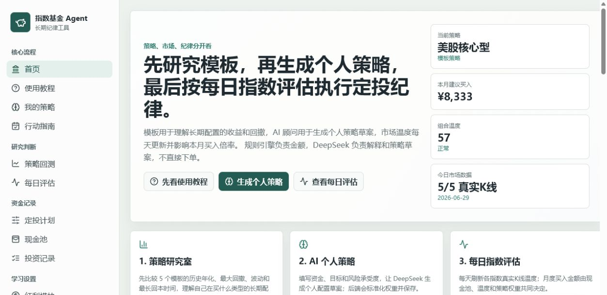

# 被动收益 Agent

被动收益 Agent 是一个本地运行的指数基金长期投资纪律工具。它帮助普通投资者先理解不同指数配置策略的长期收益和回撤，再生成自己的个人策略，最后按每日市场温度执行月度定投纪律。

项目理念来自长期指数投资：普通人不必预测市场，也不必频繁交易。更重要的是低成本、分散、长期、定期投入，并用现金池和规则引擎减少情绪化决策。

> 本项目不自动下单，不连接券商，不推荐个股，不承诺收益。AI 只解释规则结果，不直接决定买卖金额。

## 产品预览



核心流程是：先研究策略模板，再生成个人策略，随后每天查看指数温度，每月按纪律执行定投并记录。

## 当前能力

- 策略模板：内置稳健红利型、均衡复利型、美股核心型、科技成长型、A 股修复型。
- AI 个人策略：根据资金、现金流、风险偏好和投资周期生成个人指数配置草案。
- 历史回测：支持策略模板和个人策略回测，可选择任意 YYYY-MM 区间。
- 历史数据工具：使用东方财富真实 K 线缓存到本地 SQLite，并显式展示数据区间和质量。
- 每日评估：按指数展示市场温度、200 日均线位置、回撤、波动和建议节奏。
- 行动指南：把市场温度翻译成近期买入、观察和卖出边界。
- 现金池：区分应急现金、排队资金和机会资金。
- 投资记录：保存每次建议、AI 解释和是否执行，方便复盘纪律。
- AI 接口：兼容 OpenAI Chat Completions 风格接口，DeepSeek、OpenAI 兼容代理、本地兼容服务都可以接入。

## 技术栈

- 后端：Python + FastAPI
- 前端：React + Vite + TypeScript
- 数据库：SQLite
- 数据源：东方财富 K 线，本地缓存
- AI：OpenAI-compatible Chat Completions API

## 一键本地运行（Windows）

### 1. 环境要求

- Windows 10/11
- Python 3.11 或更高版本
- Node.js 20 或更高版本
- PowerShell

### 2. 安装依赖

在项目根目录运行：

```powershell
powershell -ExecutionPolicy Bypass -File .\scripts\install_windows.ps1
```

也可以双击：

```text
install_windows.bat
```

安装脚本会：

- 创建 `backend\.venv`
- 安装 Python 后端依赖
- 安装前端 Node 依赖
- 如不存在 `.env`，从 `.env.example` 复制一份

### 3. 启动应用

```powershell
powershell -ExecutionPolicy Bypass -File .\scripts\start_windows.ps1
```

也可以双击：

```text
start_windows.bat
```

启动后访问：

- 前端页面：http://127.0.0.1:5174/
- 后端健康检查：http://127.0.0.1:8010/api/health

### 4. 停止应用

```powershell
powershell -ExecutionPolicy Bypass -File .\scripts\stop_windows.ps1
```

也可以双击：

```text
stop_windows.bat
```

## 手动开发运行

后端：

```powershell
cd backend
python -m venv .venv
.\.venv\Scripts\python.exe -m pip install -r requirements.txt
.\.venv\Scripts\python.exe -m uvicorn app.main:app --reload --host 127.0.0.1 --port 8010
```

前端：

```powershell
cd frontend
npm.cmd --cache ..\.npm-cache install
npm.cmd --cache ..\.npm-cache run dev -- --host 127.0.0.1 --port 5174
```

## AI 配置

推荐在页面右侧导航进入「设置」填写：

- Provider：服务商名称，例如 `deepseek`
- Base URL：兼容 OpenAI 的接口地址，例如 `https://api.deepseek.com`
- API Key：你的密钥
- Model：模型名，例如 `deepseek-chat`
- Temperature：建议 `0.3`

也可以在 `.env` 中配置环境变量，启动脚本会自动加载：

```env
AI_PROVIDER=deepseek
AI_BASE_URL=https://api.deepseek.com
AI_API_KEY=
AI_MODEL=deepseek-chat
AI_TEMPERATURE=0.3
```

API Key 只保存在本地，不会写入投资记录，也不会在页面明文回显。

## 数据说明

回测和每日评估会优先使用本地 SQLite 中的历史行情缓存。首次运行或点击「刷新历史数据」时，系统会从公开行情源拉取数据。

当前 MVP 的重要边界：

- A500 历史不足或数据源不可用时，允许使用沪深 300 作为 A 股大盘代理，并在页面标注。
- 跨境资产使用境内 ETF 代理数据，可能受汇率、溢价、跟踪误差影响。
- 估值分位、股息率分位暂未完整接入时，会显示“缺失”，不会静默伪造。
- 回测默认不计手续费和税费，页面会提示真实收益会受费率影响。

## Docker 部署

项目包含 `Dockerfile`，可用于服务器部署：

```powershell
docker build -t passive-income-agent .
docker run -d --name passive-income-agent -p 8010:8010 -v passive_income_data:/app/data/runtime passive-income-agent
```

容器启动后访问：

```text
http://127.0.0.1:8010/
```

如果部署到云服务器，建议用 Nginx 反向代理到 `127.0.0.1:8010`，并把运行数据目录挂载到宿主机。

## 项目结构

```text
03_index_fund_agent/
  backend/
    app/                 FastAPI 应用、规则引擎、回测、数据源、SQLite 存储
    tests/               后端单元测试
    requirements.txt
  frontend/
    src/                 React 页面和 API 封装
    package.json
  scripts/
    install_windows.ps1  Windows 本地安装
    start_windows.ps1    Windows 本地启动
    stop_windows.ps1     Windows 停止本地服务
  Dockerfile
  README.md
```

## 测试

后端测试：

```powershell
$env:PYTHONPATH='backend'
.\backend\.venv\Scripts\python.exe -m pytest backend\tests
```

前端构建：

```powershell
cd frontend
npm.cmd --cache ..\.npm-cache run build
```

## 开源边界与免责声明

被动收益 Agent 是研究和纪律辅助工具，不是投资顾问。

- 不承诺收益。
- 不保证指数基金只涨不跌。
- 不推荐个股、主动基金、主题基金。
- 不接券商，不自动下单。
- 回测不代表未来收益。
- 现金管理产品、货币基金和银行低风险流动性产品也不等于保本。
- 真实投资前，请结合自己的风险承受能力、资金用途、费用、税费、汇率和基金合同。

## 参考项目

- [PA_Agent](https://github.com/rosemarycox5334-debug/PA_Agent)：本项目在开源文档组织、本地运行入口和 Agent 产品表达方式上参考了该项目的思路；业务方向已改为长期指数基金和被动收益纪律工具。

## License

MIT License
